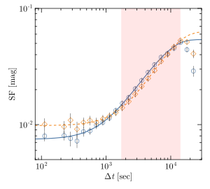

# Jirachi - Julia project for analyzing color variation in active galaxies harboring massive black holes


- JIRACHI is a cute pokemon who always makes wishes come true !!!

<!-- [](https://wssuzb.github.io/Jirachi.jl/stable/) -->
<!-- [](https://wssuzb.github.io/Jirachi.jl/dev/) -->
<!-- [](https://github.com/wssuzb/Jirachi.jl/actions/workflows/CI.yml?query=branch%3Amain) -->
<!-- [](https://codecov.io/gh/wssuzb/Jirachi.jl) -->

## About this project

Several function can be found in this project to help us get better understand the central engine of AGNs:

- color variation
- structure function
- generate DRW

This project also provide a `PYTHON` version for calculating color variation, and can be found at `py/pyColorVariation.py`.


## Install

```julia
julia> # Press the key "]"

(@v1.9) pkg> add https://github.com/wssuzb/Jirachi.jl.git
julia> using Jirachi
```

or alternatively, you can also download this `Jirachi.jl-main.zip` file, and load it by
```julia
julia> push!(LOAD_PATH, path + "Jirachi.jl-main")
julia> using Jirachi
```
you just need to modify the `path`, where the `Jirachi` is downloaded, and enjoy youself!

##

- structure function





## Citing

If this project makes you life easier, pls. cites this code as below:

```bib
@misc{Jirachi.jl,
	author  = {zhenbo su},
	title   = {Jirachi.jl},
	url     = {https://github.com/wssuzb/Jirachi.jl},
	version = {v1.0.0-DEV},
	year    = {2023},
	month   = {12}
}
```

also see [`CITATION.bib`](CITATION.bib) for the relevant reference(s).
