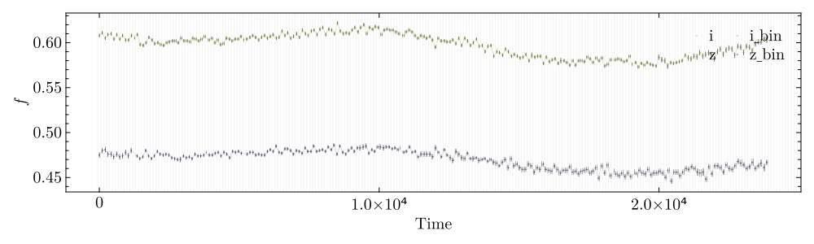
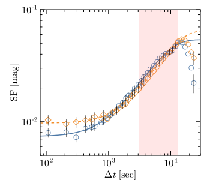

# Tutorial

To use **Jirachi**, we need to import...


## Loading light curves

```julia
# load light curves.
i_lc = load_data("./data/montano_n1_i_4395.txt", [1, 2, 3]; band="i")
z_lc = load_data("./data/montano_n1_z_4395.txt", [1, 2, 3]; band="z")

# convert time to second, and start it from 0 second.
i_lc.time = round.(i_lc.time * 24 * 3600, digits=2)
i_lc.time = i_lc.time .- i_lc.time[1]
z_lc.time = round.(z_lc.time * 24 * 3600, digits=2)
z_lc.time = z_lc.time .- z_lc.time[1]
```

- Get the light curves binned

```julia
t_binsize = 103.68
lc_edges = bin_lc_edges(t_binsize, 0, 25000)

i_lc_bin = bin_light_curve(i_lc; lc_edges = lc_edges)
z_lc_bin = bin_light_curve(z_lc; lc_edges = lc_edges)

lc1_bin, lc2_bin = get_common_lc(i_lc_bin, z_lc_bin)
```

- check and plot it !

```julia
plotlc(i_lc, i_lc_bin, z_lc, z_lc_bin; 
  		label=[i_lc.band, i_lc.band * "_bin", z_lc.band, z_lc.band * "_bin"], 
  		lc_edges=lc_edges, 
  		save_fig_path="./fig/lc_check_i_z.svg", 
  		save_fig=true, 
  		hwratio=0.3)
```



## Begin calculating structure function!

- input parameters

```julia
# structure function 
sf_bin = 0.05
sf_bin_edges = 0:sf_bin:5 # in log space
mode = "both" # lc bootstrapped for structure function error
nsim = 1000 # lc bootstrapped for structure function error
lower_bounds = [0, 0, 0, 0.001]
upper_bounds = [10, 2e4, 2, 0.1]
p0 = [1, 1e3, 1, 0.005]

t_fit = 10 .^ range(log10(1), log10(6e4), step=0.1)

# color variation
cv_bin = 0.1
cv_bin_edges = 0:cv_bin:5 # in log space
nsigma = 3
erron=true

# save all run results.
fi_np::String="./data/run_i_z.h5"

```


- Structure function

```julia
fit_sf1 = fitsf_mcmc(lc1_bin; nsim=nsim, lb = lower_bounds , ub = upper_bounds, sf_bin_edges=sf_bin_edges, p0=p0, mode = mode)
fit_sf2 = fitsf_mcmc(lc2_bin; nsim=nsim, lb = lower_bounds, ub = upper_bounds, sf_bin_edges=sf_bin_edges, p0=p0, mode = mode)

binsf1, binsf2 = fit_sf1.binsf, fit_sf2.binsf

par_1, par_1_err = fit_sf1.param, fit_sf1.param_err
par_2, par_2_err = fit_sf2.param, fit_sf2.param_err


t_break_1 = find_t_break(binsf1)
t_break_2 = find_t_break(binsf2)

itp1 = find_t_min(binsf1, par_1; t_fit=t_fit)
itp2 = find_t_min(binsf2, par_2; t_fit=t_fit)

t_min_1, sf_min_1 = itp1.t_min, itp1.sf_min
t_min_2, sf_min_2 = itp2.t_min, itp2.sf_min

t_fit_1, sf_fit_1 = itp1.t_fit, itp1.sf_fit
t_fit_2, sf_fit_2 = itp2.t_fit, itp2.sf_fit


proper_time = [maximum([t_min_1, t_min_2]), minimum([t_break_1, t_break_2])]
```


- and we can plot SF by

```julia
plotsf(binsf1, binsf2; fitsf1=[t_fit_1, sf_fit_1], fitsf2=[t_fit_2, sf_fit_2], proper_time = proper_time)
```



## calculating color variation

```julia
nsigma = nsigma
erron = erron

# cv in flux-Flux
cv_flux_res = color_variation(lc1_bin, lc2_bin, nsigma, erron, "flux")
cv_flux = cv_flux_res

bincv_flux = binned_color_variation(cv_flux, cv_bin_edges)

# cv in mag-mag
cv_mag_res = color_variation(lc1_bin, lc2_bin, nsigma, erron, "mag")
cv_mag = cv_mag_res

bincv_mag = binned_color_variation(cv_mag, cv_bin_edges)
```

and plot it


